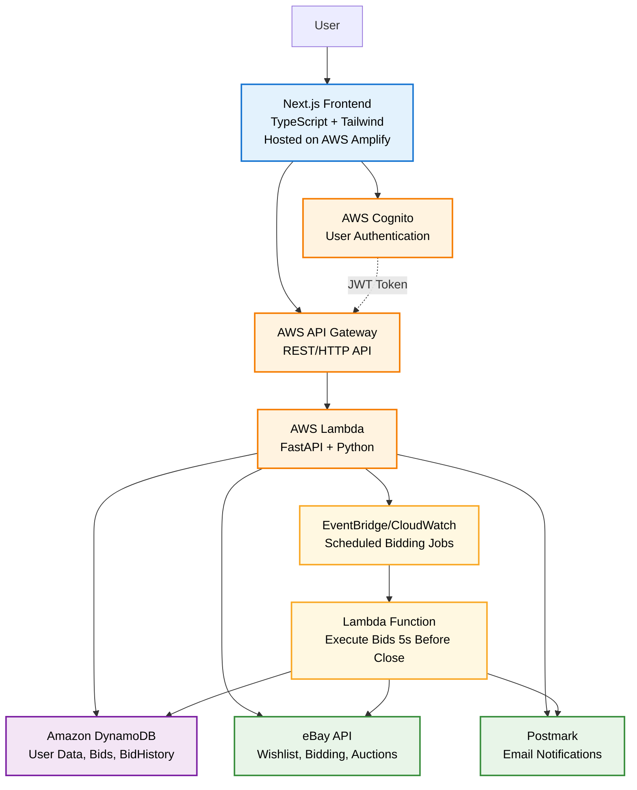

## Architecture Diagram

## Key Data Flows

### User Management
1. **User Registration/Login**: User → Frontend → Cognito → Frontend
2. **eBay Account Linking**: Frontend → API Gateway → Lambda → eBay API → DynamoDB
3. **User Preferences**: Frontend → API Gateway → Lambda → DynamoDB → Frontend

### Wishlist & Bidding
1. **Wishlist Item Retrieval**: Frontend → API Gateway → Lambda → eBay API → Frontend
2. **Create Bid**: Frontend → API Gateway → Lambda → DynamoDB → Scheduler
3. **View Active Bids**: Frontend → API Gateway → Lambda → DynamoDB → Frontend
4. **Update Bid Price**: Frontend → API Gateway → Lambda → DynamoDB → Scheduler (update job)
5. **Cancel Bid**: Frontend → API Gateway → Lambda → DynamoDB → Scheduler (remove job)

### History & Monitoring
1. **View Bid History**: Frontend → API Gateway → Lambda → DynamoDB → Frontend

### Automated Execution
1. **Scheduled Bidding**: Scheduler → BidExecutor → eBay API → DynamoDB → Postmark
