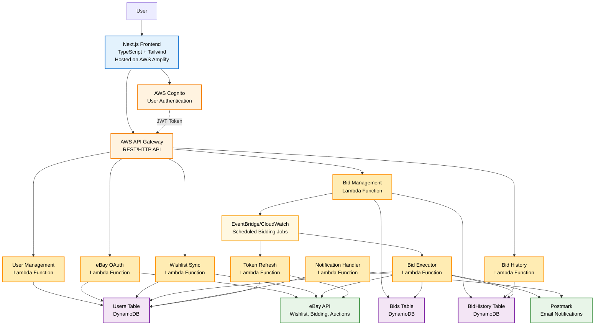

## Architecture Diagram

## Key Data Flows

### User Management
1. **User Registration/Login**: User → Frontend → Cognito → Frontend
2. **Get User Profile**: Frontend → API Gateway → User Management Lambda → DynamoDB → Frontend
3. **Update User Profile**: Frontend → API Gateway → User Management Lambda → DynamoDB → Frontend
4. **Update Preferences**: Frontend → API Gateway → User Management Lambda → DynamoDB → Frontend

### eBay Integration
1. **eBay Account Linking**: Frontend → API Gateway → eBay OAuth Lambda → eBay API → DynamoDB → Frontend
2. **OAuth Callback**: eBay → Frontend → API Gateway → eBay OAuth Lambda → DynamoDB
3. **Check Link Status**: Frontend → API Gateway → eBay OAuth Lambda → DynamoDB → Frontend
4. **Unlink Account**: Frontend → API Gateway → eBay OAuth Lambda → DynamoDB → Frontend

### Wishlist Management
1. **Sync Wishlist**: Frontend → API Gateway → Wishlist Sync Lambda → eBay API → Frontend
2. **Get Wishlist Items**: Frontend → API Gateway → Wishlist Sync Lambda → DynamoDB → Frontend
3. **Get Item Details**: Frontend → API Gateway → Wishlist Sync Lambda → eBay API → Frontend

### Bid Management
1. **Create Bid**: Frontend → API Gateway → Bid Management Lambda → DynamoDB → EventBridge Scheduler
2. **View Active Bids**: Frontend → API Gateway → Bid Management Lambda → DynamoDB → Frontend
3. **Update Bid Price**: Frontend → API Gateway → Bid Management Lambda → DynamoDB → EventBridge Scheduler (update)
4. **Cancel Bid**: Frontend → API Gateway → Bid Management Lambda → DynamoDB → EventBridge Scheduler (remove)
5. **Get Specific Bid**: Frontend → API Gateway → Bid Management Lambda → DynamoDB → Frontend

### Bid History & Analytics
1. **View Bid History**: Frontend → API Gateway → Bid History Lambda → DynamoDB → Frontend
2. **Get Bid Statistics**: Frontend → API Gateway → Bid History Lambda → DynamoDB → Frontend
3. **Get Specific History**: Frontend → API Gateway → Bid History Lambda → DynamoDB → Frontend

### Automated Execution
1. **Scheduled Bidding**: EventBridge Scheduler → Bid Executor Lambda → eBay API → DynamoDB → Notification Handler Lambda → Postmark
2. **Token Refresh**: EventBridge Scheduler → Token Refresh Lambda → eBay API → DynamoDB