# Data Flow Architecture

This document outlines the comprehensive data flow patterns, state management, and information processing workflows throughout the eBay Sniper application.

## Data Flow Overview

The eBay Sniper application follows a modern serverless architecture with clear data flow patterns between frontend, backend, external services, and data storage systems.

### High-Level Data Flow Diagram

```mermaid
graph TB
    %% User Interface Layer
    User[👤 User]
    Frontend[🌐 Next.js Frontend]
    
    %% API Gateway Layer
    APIGateway[🚪 AWS API Gateway]
    
    %% Application Layer - Individual Lambda Functions
    UserMgmtLambda[👤 User Management Lambda]
    EbayOAuthLambda[🔗 eBay OAuth Lambda]
    WishlistSyncLambda[📋 Wishlist Sync Lambda]
    BidMgmtLambda[💰 Bid Management Lambda]
    BidHistoryLambda[📊 Bid History Lambda]
    BidExecutorLambda[⚡ Bid Executor Lambda]
    NotificationLambda[📧 Notification Lambda]
    TokenRefreshLambda[🔑 Token Refresh Lambda]
    
    %% Data Layer
    DynamoDB[(📊 DynamoDB Tables)]
    
    %% External Services
    eBayAPI[🛍️ eBay API]
    Postmark[📧 Postmark Email]
    
    %% Authentication & Scheduling
    Cognito[🔐 AWS Cognito]
    EventBridge[⏰ EventBridge Scheduler]
    SecretsManager[🔑 AWS Secrets Manager]
    
    %% Data Flow Connections
    User --> Frontend
    Frontend --> APIGateway
    Cognito --> APIGateway
    
    %% API Gateway to Lambda Functions
    APIGateway --> UserMgmtLambda
    APIGateway --> EbayOAuthLambda
    APIGateway --> WishlistSyncLambda
    APIGateway --> BidMgmtLambda
    APIGateway --> BidHistoryLambda
    
    %% Lambda Function Data Connections
    UserMgmtLambda --> DynamoDB
    EbayOAuthLambda --> DynamoDB
    EbayOAuthLambda --> eBayAPI
    EbayOAuthLambda --> SecretsManager
    WishlistSyncLambda --> DynamoDB
    WishlistSyncLambda --> eBayAPI
    WishlistSyncLambda --> SecretsManager
    BidMgmtLambda --> DynamoDB
    BidMgmtLambda --> EventBridge
    BidHistoryLambda --> DynamoDB
    BidExecutorLambda --> DynamoDB
    BidExecutorLambda --> eBayAPI
    BidExecutorLambda --> SecretsManager
    NotificationLambda --> DynamoDB
    NotificationLambda --> Postmark
    NotificationLambda --> SecretsManager
    TokenRefreshLambda --> DynamoDB
    TokenRefreshLambda --> eBayAPI
    TokenRefreshLambda --> SecretsManager
    
    %% Scheduled Executions
    EventBridge --> BidExecutorLambda
    EventBridge --> TokenRefreshLambda
    
```



## Core Data Entities

### Data Models and Relationships


## Frontend Data Flow

### State Management Architecture

#### 1. Client-Side State Management
```typescript
// Frontend state architecture
interface AppState {
  auth: AuthState
  user: UserState
  bids: BidsState
  wishlist: WishlistState
  ui: UIState
}

interface AuthState {
  isAuthenticated: boolean
  user: User | null
  token: string | null
  loading: boolean
  error: string | null
}

interface BidsState {
  activeBids: Bid[]
  bidHistory: BidHistoryItem[]
  loading: boolean
  error: string | null
  pagination: PaginationState
}
```

#### 2. Data Fetching Patterns
```typescript
// Custom hooks for data management
export function useBids() {
  const [state, setState] = useState<BidsState>({
    activeBids: [],
    bidHistory: [],
    loading: false,
    error: null,
    pagination: { hasMore: false, offset: 0, limit: 20 }
  })

  const fetchBids = useCallback(async (filters?: BidFilters) => {
    setState(prev => ({ ...prev, loading: true, error: null }))
    
    try {
      const response = await API.get('ebay-api', '/bids', {
        queryStringParameters: filters
      })
      
      setState(prev => ({
        ...prev,
        activeBids: response.bids,
        pagination: response.pagination,
        loading: false
      }))
    } catch (error) {
      setState(prev => ({
        ...prev,
        error: 'Failed to fetch bids',
        loading: false
      }))
    }
  }, [])

  return { ...state, fetchBids, createBid, updateBid, cancelBid }
}
```

#### 3. Real-time Updates
```typescript
// WebSocket connection for real-time bid updates
export function useRealtimeBids() {
  const [socket, setSocket] = useState<WebSocket | null>(null)
  const { updateBidStatus } = useBids()

  useEffect(() => {
    const ws = new WebSocket(process.env.NEXT_PUBLIC_WS_URL)
    
    ws.onmessage = (event) => {
      const data = JSON.parse(event.data)
      
      switch (data.type) {
        case 'BID_STATUS_UPDATE':
          updateBidStatus(data.bidId, data.status)
          break
        case 'AUCTION_ENDING_SOON':
          showNotification(`Auction ending in ${data.timeRemaining}`)
          break
      }
    }
    
    setSocket(ws)
    return () => ws.close()
  }, [])
}
```

### Component Data Flow

#### 1. Bid Creation Flow
```typescript
// BidForm component data flow
export function BidForm({ item }: { item: WishlistItem }) {
  const { createBid } = useBids()
  const { user } = useAuth()
  
  const handleSubmit = async (formData: CreateBidRequest) => {
    // Client-side validation
    if (formData.maxBidAmount <= item.currentPrice) {
      setError('Bid must be higher than current price')
      return
    }
    
    // Optimistic update
    const tempBid = {
      ...formData,
      bidId: 'temp-' + Date.now(),
      status: 'PENDING',
      userId: user.userId
    }
    
    addOptimisticBid(tempBid)
    
    try {
      // API call
      const createdBid = await createBid(formData)
      
      // Replace optimistic update with real data
      replaceOptimisticBid(tempBid.bidId, createdBid)
      
      // Navigation
      router.push('/bids')
      
    } catch (error) {
      // Rollback optimistic update
      removeOptimisticBid(tempBid.bidId)
      setError('Failed to create bid')
    }
  }
}
```

## Backend Data Flow

### API Request Processing

#### 1. Request Lifecycle (Individual Lambda Functions)


#### 2. Individual Lambda Function Data Processing

##### Bid Management Lambda Processing
```python
# Bid Management Lambda - handles bid CRUD operations
from aws_lambda_powertools import Logger, Tracer
from aws_lambda_powertools.event_handler import APIGatewayRestResolver
from aws_lambda_powertools.event_handler.exceptions import BadRequestError, ConflictError

logger = Logger()
tracer = Tracer()
app = APIGatewayRestResolver()

@app.post("/bids")
@tracer.capture_method
def create_bid():
    """Bid Management Lambda - Create new bid"""
    
    # 1. Parse and validate input - single validation layer
    raw_body = app.current_event.json_body
    request = CreateBidRequest(**raw_body)  # Pydantic validation
    
    # Get current user from JWT context (already validated by API Gateway)
    current_user = get_current_user(app)
    
    # 2. Business logic validation - only cross-entity rules
    validate_bid_business_rules(request, current_user['sub'])
    
    # 3. Create bid entity
    bid_entity = {
        'bidId': str(uuid.uuid4()),
        'userId': current_user['sub'],
        'ebayItemId': request.ebay_item_id,
        'maxBidAmount': request.max_bid_amount,
        'status': 'PENDING',
        'createdAt': int(time.time()),
        'updatedAt': int(time.time())
    }
    
    # 4. Database transaction
    try:
        # Create bid and history records atomically
        execute_bid_transaction(bid_entity)
        
        # Schedule bid execution via EventBridge
        schedule_id = schedule_bid_execution(bid_entity)
        
        # Update bid with scheduler ID
        update_bid_scheduler_id(bid_entity['bidId'], schedule_id)
        
    except ClientError as e:
        handle_database_error(e)
    
    return BidResponse(**bid_entity).dict()
```

##### eBay OAuth Lambda Processing
```python
# eBay OAuth Lambda - handles OAuth flow
@app.post("/ebay/auth/callback")
@tracer.capture_method
def handle_oauth_callback():
    """eBay OAuth Lambda - Handle OAuth callback"""
    
    # 1. Validate OAuth callback
    callback_request = OAuthCallbackRequest(**app.current_event.json_body)
    current_user = get_current_user(app)
    
    # 2. Exchange code for tokens
    try:
        tokens = await ebay_client.exchange_code_for_tokens(
            callback_request.code,
            callback_request.state
        )
        
        # 3. Store encrypted tokens in DynamoDB
        user_update = {
            'userId': current_user['sub'],
            'ebayTokens': tokens,  # DynamoDB encrypts automatically
            'ebayAccountId': tokens.get('ebay_account_id'),
            'linkedAt': int(time.time()),
            'updatedAt': int(time.time())
        }
        
        users_table.put_item(Item=user_update)
        
        return EbayAccountStatus(
            isLinked=True,
            accountId=tokens.get('ebay_account_id'),
            linkedAt=user_update['linkedAt'],
            tokenExpiresAt=tokens.get('expires_at')
        ).dict()
        
    except EbayAPIError as e:
        raise BadRequestError(f"OAuth exchange failed: {str(e)}")
```

##### Wishlist Sync Lambda Processing
```python
# Wishlist Sync Lambda - retrieves and syncs wishlist items
@app.get("/wishlist/items")
@tracer.capture_method
def get_wishlist_items():
    """Wishlist Sync Lambda - Get synced wishlist items"""
    
    current_user = get_current_user(app)
    
    # 1. Get user's eBay tokens
    user_data = get_user_with_ebay_tokens(current_user['sub'])
    if not user_data.get('ebayTokens'):
        raise BadRequestError("eBay account not linked")
    
    # 2. Fetch wishlist from eBay API
    try:
        wishlist_items = await ebay_client.get_wishlist_items(
            user_data['ebayTokens']['access_token']
        )
        
        # 3. Filter for active auctions
        active_items = filter_active_auctions(wishlist_items)
        
        # 4. Transform to internal format
        transformed_items = [
            WishlistItem(**transform_ebay_item(item))
            for item in active_items
        ]
        
        return WishlistResponse(
            items=transformed_items,
            lastSyncAt=int(time.time()),
            totalItems=len(transformed_items)
        ).dict()
        
    except EbayAPIError as e:
        if e.is_rate_limited():
            raise ServiceError("eBay API rate limit exceeded")
        raise ServiceError(f"eBay API error: {str(e)}")
```

##### Bid Executor Lambda Processing
```python
# Bid Executor Lambda - executes scheduled bids
from aws_lambda_powertools.utilities.typing import LambdaContext

@tracer.capture_lambda_handler
def lambda_handler(event: dict, context: LambdaContext) -> dict:
    """Bid Executor Lambda - Execute scheduled bid"""
    
    # 1. Parse EventBridge scheduler event
    bid_execution_event = BidExecutionEvent(**event)
    
    # 2. Get bid details and user tokens
    bid_data = get_bid_details(bid_execution_event.bid_id, bid_execution_event.user_id)
    user_tokens = get_user_ebay_tokens(bid_execution_event.user_id)
    
    # 3. Validate bid is still executable
    if bid_data['status'] != 'PENDING':
        logger.warning(f"Bid {bid_execution_event.bid_id} not in pending status")
        return {"status": "SKIPPED", "reason": "Bid not pending"}
    
    # 4. Execute bid via eBay API
    try:
        # Wait until 5 seconds before auction end
        wait_until_optimal_bid_time(bid_execution_event.auction_end_time)
        
        # Place bid
        bid_result = await ebay_client.place_bid(
            bid_execution_event.ebay_item_id,
            bid_execution_event.max_bid_amount,
            user_tokens['access_token']
        )
        
        # 5. Update bid status and create history
        update_bid_status(bid_execution_event.bid_id, 'PLACED', bid_result)
        create_bid_history_record(bid_execution_event, 'PLACE', bid_result)
        
        # 6. Trigger notification via SNS
        publish_bid_notification(bid_execution_event, bid_result)
        
        return BidExecutionResult(
            bidId=bid_execution_event.bid_id,
            success=True,
            ebayBidId=bid_result.get('bid_id'),
            executedAt=int(time.time())
        ).dict()
        
    except Exception as e:
        logger.error(f"Bid execution failed: {str(e)}")
        update_bid_status(bid_execution_event.bid_id, 'FAILED', {'error': str(e)})
        return {"status": "FAILED", "error": str(e)}
```

### Database Access Patterns

#### 1. Query Patterns
```python
# Optimized DynamoDB access patterns
class BidRepository:
    def __init__(self, table):
        self.table = table
    
    async def get_user_bids(
        self, 
        user_id: str, 
        status_filter: Optional[str] = None,
        limit: int = 20,
        last_key: Optional[Dict] = None
    ) -> Dict[str, Any]:
        """Efficient pagination and filtering"""
        
        query_params = {
            'KeyConditionExpression': Key('userId').eq(user_id),
            'Limit': limit,
            'ScanIndexForward': False  # Latest first
        }
        
        if status_filter:
            query_params['FilterExpression'] = Attr('status').eq(status_filter)
        
        if last_key:
            query_params['ExclusiveStartKey'] = last_key
        
        response = self.table.query(**query_params)
        
        return {
            'items': response.get('Items', []),
            'last_key': response.get('LastEvaluatedKey'),
            'has_more': 'LastEvaluatedKey' in response
        }
    
    async def batch_update_bid_statuses(
        self, 
        bid_updates: List[Dict[str, Any]]
    ) -> None:
        """Efficient batch updates for bid status changes"""
        
        with self.table.batch_writer() as batch:
            for update in bid_updates:
                batch.put_item(Item=update)
```

#### 2. Data Consistency Patterns
```python
# Transaction handling for data consistency
from boto3.dynamodb.conditions import Key, Attr
from botocore.exceptions import ClientError

async def execute_bid_transaction(bid_data: Dict[str, Any]) -> Dict[str, Any]:
    """Ensure data consistency across multiple operations"""
    
    try:
        # Start transaction
        with dynamodb.meta.client.transact_write_items as transact:
            
            # 1. Create bid record
            transact.append({
                'Put': {
                    'TableName': 'Bids',
                    'Item': bid_data,
                    'ConditionExpression': 'attribute_not_exists(bidId)'
                }
            })
            
            # 2. Create history record
            history_data = create_history_record(bid_data, 'CREATE')
            transact.append({
                'Put': {
                    'TableName': 'BidHistory',
                    'Item': history_data
                }
            })
            
            # 3. Update user's bid count
            transact.append({
                'Update': {
                    'TableName': 'Users',
                    'Key': {'userId': bid_data['userId']},
                    'UpdateExpression': 'ADD activeBidCount :inc',
                    'ExpressionAttributeValues': {':inc': 1}
                }
            })
            
            # Execute transaction
            transact.execute()
            
    except ClientError as e:
        if e.response['Error']['Code'] == 'TransactionCanceledException':
            raise ConflictError("Bid already exists for this item")
        raise DatabaseError(f"Transaction failed: {str(e)}")
```

## External Service Integration

### eBay API Data Flow

#### 1. Authentication Flow


#### 2. Data Synchronization
```python
# eBay data synchronization patterns
class eBayDataSyncService:
    def __init__(self, ebay_client):
        self.ebay_client = ebay_client
        self.dynamodb = boto3.resource('dynamodb')
        self.users_table = self.dynamodb.Table('ebay-sniper-Users')
    
    async def sync_user_wishlist(self, user_id: str) -> List[Dict[str, Any]]:
        """Sync user's eBay wishlist with current auction data"""
        
        # Get user's eBay tokens directly from DynamoDB
        response = self.users_table.get_item(Key={'userId': user_id})
        user = response.get('Item')
        if not user or not user.get('ebayTokens'):
            raise ValueError("User has not linked eBay account")
        
        # Get tokens (automatically decrypted by DynamoDB)
        tokens = user['ebayTokens']
        
        # Fetch wishlist from eBay
        wishlist_items = await self.ebay_client.get_wishlist_items(
            tokens['access_token']
        )
        
        # Filter for active auctions
        active_auctions = []
        for item in wishlist_items:
            if await self.is_auction_active(item['ebay_item_id'], tokens):
                item_details = await self.ebay_client.get_item_details(
                    item['ebay_item_id'],
                    tokens['access_token']
                )
                active_auctions.append(item_details)
        
        # Cache results with TTL
        await self.cache_wishlist_data(user_id, active_auctions, ttl=300)
        
        return active_auctions
    
    async def refresh_item_data(
        self, 
        ebay_item_id: str, 
        tokens: Dict[str, str]
    ) -> Dict[str, Any]:
        """Refresh individual item data from eBay"""
        
        try:
            # Get current item data
            item_data = await self.ebay_client.get_item_details(
                ebay_item_id,
                tokens['access_token']
            )
            
            # Update cached data
            await self.update_cached_item_data(ebay_item_id, item_data)
            
            return item_data
            
        except eBayAPIError as e:
            if e.code == 'ITEM_NOT_FOUND':
                # Item was removed, mark bids as invalid
                await self.mark_bids_invalid(ebay_item_id)
            raise
```

### Email Notification Flow

#### 1. Notification Pipeline
```python
# Email notification data flow
class NotificationService:
    def __init__(self, postmark_client, template_engine):
        self.postmark_client = postmark_client
        self.template_engine = template_engine
    
    async def process_bid_notification(
        self, 
        bid_event: Dict[str, Any]
    ) -> None:
        """Process bid-related notifications"""
        
        # Get user preferences
        user = await get_user(bid_event['user_id'])
        
        # Check if notifications are enabled
        if not self.should_send_notification(user, bid_event['type']):
            return
        
        # Prepare notification data
        notification_data = await self.prepare_notification_data(
            bid_event, 
            user
        )
        
        # Render email template
        email_content = await self.template_engine.render(
            template=bid_event['type'],
            data=notification_data
        )
        
        # Send email
        await self.postmark_client.send_email(
            to=user.email,
            subject=email_content['subject'],
            html_body=email_content['html'],
            text_body=email_content['text']
        )
        
        # Log notification
        await self.log_notification_sent(bid_event, user.user_id)
    
    def should_send_notification(
        self, 
        user: User, 
        notification_type: str
    ) -> bool:
        """Check user preferences for notification type"""
        
        preference_map = {
            'BID_WON': user.preferences.bid_win_notifications,
            'BID_LOST': user.preferences.bid_loss_notifications,
            'BID_PLACED': user.preferences.email_notifications,
            'AUCTION_ENDING': user.preferences.email_notifications
        }
        
        return preference_map.get(notification_type, False)
```

## Scheduled Processing

### Bid Execution Data Flow

#### 1. Scheduling Workflow


#### 2. Bid Execution Logic
```python
# Bid execution data processing
class BidExecutorService:
    def __init__(self, ebay_client, bid_repository, notification_service):
        self.ebay_client = ebay_client
        self.bid_repository = bid_repository
        self.notification_service = notification_service
    
    async def execute_scheduled_bid(self, bid_id: str, user_id: str) -> Dict[str, Any]:
        """Execute a scheduled bid at the optimal time"""
        
        # Get bid details
        bid = await self.bid_repository.get_bid(user_id, bid_id)
        if not bid:
            raise ValueError(f"Bid not found: {bid_id}")
        
        # Verify bid is still valid
        if bid.status != BidStatus.PENDING:
            logger.warning(f"Bid {bid_id} is not in pending status: {bid.status}")
            return {"status": "SKIPPED", "reason": "Bid not pending"}
        
        try:
            # Get current item status
            item_data = await self.get_current_item_data(bid.ebay_item_id, bid.user_id)
            
            # Validate bid is still viable
            validation_result = await self.validate_bid_execution(bid, item_data)
            if not validation_result.valid:
                await self.mark_bid_failed(bid, validation_result.reason)
                return {"status": "FAILED", "reason": validation_result.reason}
            
            # Execute the bid
            bid_result = await self.place_ebay_bid(bid, item_data)
            
            # Update bid status based on result
            await self.process_bid_result(bid, bid_result)
            
            # Send notification
            await self.notification_service.send_bid_result_notification(
                bid, 
                bid_result
            )
            
            return {"status": "SUCCESS", "result": bid_result}
            
        except Exception as e:
            logger.error(f"Bid execution failed for {bid_id}: {str(e)}")
            await self.mark_bid_failed(bid, str(e))
            return {"status": "ERROR", "error": str(e)}
    
    async def place_ebay_bid(
        self, 
        bid: Bid, 
        item_data: Dict[str, Any]
    ) -> Dict[str, Any]:
        """Place the actual bid on eBay"""
        
        # Get user's eBay tokens
        user_tokens = await self.get_user_ebay_tokens(bid.user_id)
        
        # Calculate optimal bid timing
        time_until_end = item_data['end_time'] - time.time()
        if time_until_end > 10:  # More than 10 seconds left
            await asyncio.sleep(time_until_end - 5)  # Wait until 5s before end
        
        # Place the bid
        bid_response = await self.ebay_client.place_bid(
            item_id=bid.ebay_item_id,
            bid_amount=bid.max_bid_amount / 100,  # Convert cents to dollars
            access_token=user_tokens['access_token']
        )
        
        return bid_response
```

## Data Transformation

### Request/Response Transformation

#### 1. API Data Transformation
```python
# Data transformation layer
from typing import Dict, Any, List
from decimal import Decimal

class DataTransformer:
    @staticmethod
    def transform_ebay_item_to_internal(ebay_item: Dict[str, Any]) -> Dict[str, Any]:
        """Transform eBay API response to internal format"""
        
        return {
            'ebay_item_id': ebay_item['itemId'],
            'title': ebay_item['title'],
            'current_price': int(float(ebay_item['price']['value']) * 100),  # Convert to cents
            'end_time': int(datetime.fromisoformat(
                ebay_item['itemEndDate'].replace('Z', '+00:00')
            ).timestamp()),
            'image_urls': [img['imageUrl'] for img in ebay_item.get('image', [])],
            'seller_info': {
                'seller_id': ebay_item['seller']['username'],
                'seller_name': ebay_item['seller'].get('feedbackScore', 0),
                'feedback_score': ebay_item['seller'].get('feedbackScore', 0),
                'feedback_percentage': ebay_item['seller'].get('positiveFeedbackPercent', 0)
            },
            'category_id': ebay_item.get('categoryId'),
            'condition': ebay_item.get('condition', {}).get('conditionDisplayName', 'Unknown'),
            'location': ebay_item.get('itemLocation', {}).get('city', 'Unknown'),
            'shipping_cost': int(float(ebay_item.get('shippingOptions', [{}])[0].get('shippingCost', {}).get('value', '0')) * 100)
        }
    
    @staticmethod
    def transform_bid_to_response(bid: Dict[str, Any]) -> Dict[str, Any]:
        """Transform internal bid data to API response format"""
        
        return {
            'bidId': bid['bidId'],
            'userId': bid['userId'],
            'ebayItemId': bid['ebayItemId'],
            'maxBidAmount': bid['maxBidAmount'],
            'status': bid['status'],
            'auctionEndTime': bid['auctionEndTime'],
            'createdAt': bid['createdAt'],
            'updatedAt': bid['updatedAt'],
            'schedulerJobId': bid.get('schedulerJobId'),
            'itemTitle': bid.get('itemTitle'),
            'itemImageUrl': bid.get('itemImageUrl'),
            'currentPrice': bid.get('currentPrice')
        }
    
    @staticmethod
    def transform_pagination_response(
        items: List[Dict[str, Any]], 
        pagination_info: Dict[str, Any]
    ) -> Dict[str, Any]:
        """Transform paginated data to standard response format"""
        
        return {
            'items': items,
            'pagination': {
                'total': pagination_info.get('total', len(items)),
                'limit': pagination_info.get('limit', 20),
                'offset': pagination_info.get('offset', 0),
                'hasMore': pagination_info.get('has_more', False)
            }
        }
```

### Validation Pipeline

#### Consolidated Pydantic Validation
```python
# Single layer validation using Pydantic with Lambda PowerTools integration
from pydantic import BaseModel, Field, validator
from typing import Optional, Dict, Any
import boto3
from boto3.dynamodb.conditions import Key
import time
import re

class CreateBidRequest(BaseModel):
    """Single validation layer handles all input validation"""
    ebay_item_id: str = Field(..., min_length=1, max_length=20, regex=r'^[0-9]+$')
    max_bid_amount: int = Field(..., ge=100, le=10000000, description="Amount in cents")
    
    class Config:
        schema_extra = {
            "example": {
                "ebay_item_id": "123456789",
                "max_bid_amount": 25000  # $250.00
            }
        }

# Simplified business rule validation - only for cross-entity rules
async def validate_bid_business_rules(
    request: CreateBidRequest,
    user_id: str,
    ebay_client,
    dynamodb_table
) -> Dict[str, Any]:
    """Business validation - only cross-entity rules"""
    
    # Check for existing active bids (cross-entity rule)
    response = dynamodb_table.query(
        KeyConditionExpression=Key('userId').eq(user_id),
        FilterExpression=Attr('ebayItemId').eq(request.ebay_item_id) & Attr('status').eq('PENDING')
    )
    
    if response['Items']:
        raise ValueError("You already have an active bid for this item")
    
    # Fetch item data for real-time validation
    try:
        item_data = await ebay_client.get_item_details(
            request.ebay_item_id,
            user_tokens['access_token']
        )
        
        # Only critical real-time validations
        time_until_end = item_data['end_time'] - time.time()
        if time_until_end < 60:
            raise ValueError("Auction ends too soon to place bid")
        
        if request.max_bid_amount <= item_data['current_price']:
            raise ValueError("Bid amount must be higher than current price")
            
        return item_data
        
    except Exception as e:
        raise ValueError(f"Unable to validate item: {str(e)}")

# Lambda PowerTools endpoint with consolidated validation
@app.post("/bids")
@tracer.capture_method
def create_bid():
    """Create bid with single validation layer"""
    # Parse and validate request body
    raw_body = app.current_event.json_body
    request = CreateBidRequest(**raw_body)  # Pydantic handles all input validation
    
    # Get current user from JWT context
    current_user = get_current_user(app)
    
    # Only business rule validation needed - Pydantic handled input validation
    item_data = validate_bid_business_rules(
        request, 
        current_user['sub'], 
        ebay_client, 
        bids_table
    )
    
    # Direct DynamoDB operation - no repository layer
    bid_data = {
        'bidId': str(uuid.uuid4()),
        'userId': current_user['sub'],
        'ebayItemId': request.ebay_item_id,
        'maxBidAmount': request.max_bid_amount,
        'status': 'PENDING',
        'auctionEndTime': item_data['end_time'],
        'createdAt': int(time.time()),
        'updatedAt': int(time.time())
    }
    
    bids_table.put_item(Item=bid_data)
    return BidResponse(**bid_data).dict()
```

## Error Handling and Data Recovery

### Error Propagation Patterns

#### 1. Error Handling Pipeline
```python
# Comprehensive error handling
from enum import Enum
from typing import Dict, Any, Optional

class ErrorSeverity(Enum):
    LOW = "low"
    MEDIUM = "medium"
    HIGH = "high"
    CRITICAL = "critical"

class DataFlowError(Exception):
    def __init__(
        self, 
        message: str, 
        severity: ErrorSeverity,
        context: Optional[Dict[str, Any]] = None,
        recoverable: bool = True
    ):
        self.message = message
        self.severity = severity
        self.context = context or {}
        self.recoverable = recoverable
        super().__init__(message)

class ErrorHandler:
    def __init__(self, logger, notification_service):
        self.logger = logger
        self.notification_service = notification_service
    
    async def handle_data_flow_error(
        self, 
        error: DataFlowError,
        operation_context: Dict[str, Any]
    ) -> Dict[str, Any]:
        """Handle errors in data flow with appropriate recovery"""
        
        # Log error with context
        self.logger.error(
            f"Data flow error: {error.message}",
            extra={
                'severity': error.severity.value,
                'context': error.context,
                'operation': operation_context,
                'recoverable': error.recoverable
            }
        )
        
        # Determine recovery strategy
        if error.recoverable:
            recovery_result = await self.attempt_recovery(error, operation_context)
            if recovery_result['success']:
                return recovery_result
        
        # Alert if critical
        if error.severity in [ErrorSeverity.HIGH, ErrorSeverity.CRITICAL]:
            await self.notification_service.send_error_alert(error, operation_context)
        
        # Return error response
        return {
            'success': False,
            'error': error.message,
            'severity': error.severity.value,
            'recoverable': error.recoverable
        }
    
    async def attempt_recovery(
        self, 
        error: DataFlowError,
        context: Dict[str, Any]
    ) -> Dict[str, Any]:
        """Attempt to recover from data flow errors"""
        
        recovery_strategies = {
            'eBayAPIError': self.recover_ebay_api_error,
            'DatabaseError': self.recover_database_error,
            'ValidationError': self.recover_validation_error
        }
        
        strategy = recovery_strategies.get(type(error).__name__)
        if strategy:
            return await strategy(error, context)
        
        return {'success': False, 'message': 'No recovery strategy available'}
```

### Data Consistency Patterns

#### 1. Eventual Consistency Handling
```python
# Handle eventual consistency in distributed systems
class ConsistencyManager:
    def __init__(self, retry_config):
        self.retry_config = retry_config
    
    async def ensure_data_consistency(
        self, 
        operation: str,
        data: Dict[str, Any],
        consistency_checks: List[callable]
    ) -> bool:
        """Ensure data consistency across distributed components"""
        
        max_retries = self.retry_config.get('max_retries', 3)
        delay = self.retry_config.get('initial_delay', 1)
        
        for attempt in range(max_retries):
            try:
                # Run all consistency checks
                all_consistent = True
                for check in consistency_checks:
                    if not await check(data):
                        all_consistent = False
                        break
                
                if all_consistent:
                    return True
                
                # Wait before retry with exponential backoff
                await asyncio.sleep(delay * (2 ** attempt))
                
            except Exception as e:
                logger.warning(f"Consistency check failed on attempt {attempt + 1}: {str(e)}")
        
        # Consistency not achieved - trigger compensation
        await self.trigger_compensation_logic(operation, data)
        return False
    
    async def trigger_compensation_logic(
        self, 
        operation: str, 
        data: Dict[str, Any]
    ) -> None:
        """Trigger compensation logic for consistency failures"""
        
        compensation_actions = {
            'bid_creation': self.compensate_bid_creation,
            'bid_update': self.compensate_bid_update,
            'bid_execution': self.compensate_bid_execution
        }
        
        action = compensation_actions.get(operation)
        if action:
            await action(data)
```

## Monitoring and Observability

### Data Flow Monitoring

#### 1. Data Flow Metrics
```python
# Comprehensive monitoring of data flows
import time
from typing import Dict, Any
import boto3

class DataFlowMonitor:
    def __init__(self, cloudwatch_client):
        self.cloudwatch = cloudwatch_client
        self.namespace = 'EbaySniperApp/DataFlow'
    
    async def track_data_flow_operation(
        self, 
        operation: str,
        start_time: float,
        success: bool,
        metadata: Dict[str, Any] = None
    ) -> None:
        """Track data flow operation metrics"""
        
        duration = time.time() - start_time
        
        # Basic metrics
        metrics = [
            {
                'MetricName': f'{operation}_Duration',
                'Value': duration * 1000,  # Convert to milliseconds
                'Unit': 'Milliseconds'
            },
            {
                'MetricName': f'{operation}_Count',
                'Value': 1,
                'Unit': 'Count'
            }
        ]
        
        # Success/failure metrics
        if success:
            metrics.append({
                'MetricName': f'{operation}_Success',
                'Value': 1,
                'Unit': 'Count'
            })
        else:
            metrics.append({
                'MetricName': f'{operation}_Error',
                'Value': 1,
                'Unit': 'Count'
            })
        
        # Add metadata as dimensions
        dimensions = []
        if metadata:
            for key, value in metadata.items():
                if isinstance(value, (str, int, float)):
                    dimensions.append({
                        'Name': key,
                        'Value': str(value)
                    })
        
        # Send to CloudWatch
        try:
            self.cloudwatch.put_metric_data(
                Namespace=self.namespace,
                MetricData=[
                    {**metric, 'Dimensions': dimensions} 
                    for metric in metrics
                ]
            )
        except Exception as e:
            logger.error(f"Failed to send metrics: {str(e)}")
    
    def create_data_flow_dashboard(self) -> str:
        """Create CloudWatch dashboard for data flow monitoring"""
        
        dashboard_body = {
            "widgets": [
                {
                    "type": "metric",
                    "properties": {
                        "metrics": [
                            [self.namespace, "BidCreation_Duration"],
                            [self.namespace, "BidExecution_Duration"],
                            [self.namespace, "EbaySync_Duration"]
                        ],
                        "view": "timeSeries",
                        "stacked": False,
                        "region": "us-east-1",
                        "title": "Data Flow Operation Durations"
                    }
                },
                {
                    "type": "metric", 
                    "properties": {
                        "metrics": [
                            [self.namespace, "BidCreation_Success"],
                            [self.namespace, "BidCreation_Error"],
                            [self.namespace, "BidExecution_Success"],
                            [self.namespace, "BidExecution_Error"]
                        ],
                        "view": "number",
                        "region": "us-east-1",
                        "title": "Success/Error Rates"
                    }
                }
            ]
        }
        
        return json.dumps(dashboard_body)
```

This comprehensive data flow documentation provides a complete picture of how information moves through the eBay Sniper application, from user interactions to data persistence and external service integration. The patterns and examples shown here ensure maintainable, scalable, and observable data flows throughout the system.