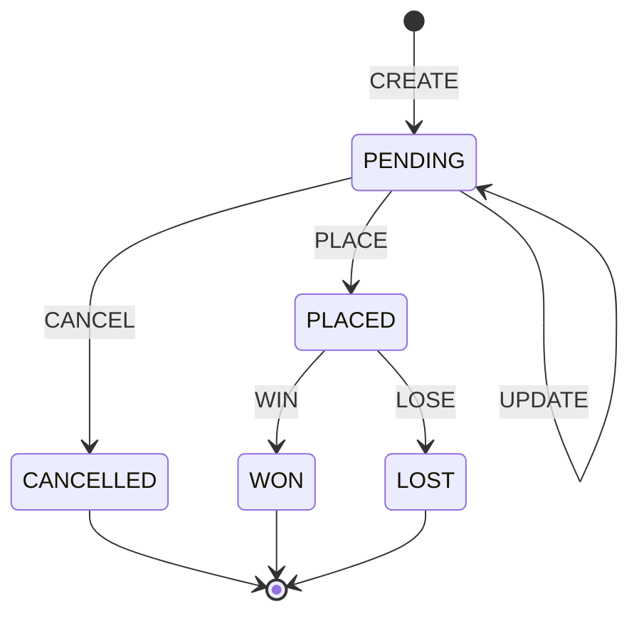

# Database Schema

This document outlines the DynamoDB table structures, data models, and query patterns for the eBay Sniper application.

## Table Overview

The application uses multiple DynamoDB tables optimized for different access patterns:

- **Users**: User profiles and authentication data
- **Bids**: Active and pending bid information with efficient user-based queries
- **BidHistory**: Historical bid records for auditing with timeline queries

## Design Principles

- **Partition Key Strategy**: Use entity identifiers (userId, ebayItemId) as partition keys for even distribution
- **Sort Key Strategy**: Use composite sort keys for efficient range queries
- **GSI Design**: Avoid hot partitions by using random suffixes and time buckets
- **Data Types**: Use Unix timestamps (Number) for efficient sorting and filtering
- **TTL**: Enable automatic cleanup of old/expired data
- **Cost Optimization**: Design GSIs to minimize unused capacity and storage

## Table Structures

### Users Table

**Table Name**: `ebay-sniper-users-{environment}`

| Attribute | Type | Key | Description |
|-----------|------|-----|-------------|
| userId | String | PK | Unique user identifier (Cognito sub) |
| email | String | - | User email address |
| createdAt | Number | - | Unix timestamp of account creation |
| updatedAt | Number | - | Unix timestamp of last update |
| ebayAccountId | String | - | Linked eBay account identifier |
| ebayTokens | Map | - | eBay OAuth tokens (encrypted at rest via DynamoDB) |
| preferences | Map | - | User preferences object |
| isActive | Boolean | - | Account status |

**Global Secondary Indexes**:
- **EmailIndex**: GSI on `email` attribute for email-based lookups

### Bids Table

**Table Name**: `ebay-sniper-bids-{environment}`

| Attribute | Type | Key | Description |
|-----------|------|-----|-------------|
| userId | String | PK | User who placed the bid (partition key) |
| bidId | String | SK | Unique bid identifier (UUID) |
| ebayItemId | String | - | eBay auction item ID |
| maxBidAmount | Number | - | Maximum bid amount in cents |
| status | String | - | PENDING, PLACED, WON, LOST, CANCELLED |
| auctionEndTime | Number | - | Unix timestamp of auction end |
| createdAt | Number | - | Unix timestamp of bid creation |
| updatedAt | Number | - | Unix timestamp of last update |
| schedulerJobId | String | - | AWS EventBridge rule ID |
| itemTitle | String | - | eBay item title (cached) |
| itemImageUrl | String | - | eBay item image URL (cached) |
| currentPrice | Number | - | Last known current price in cents |
| ttl | Number | - | TTL for completed bids (Unix timestamp) |

### BidHistory Table

**Table Name**: `ebay-sniper-bid-history-{environment}`

| Attribute | Type | Key | Description |
|-----------|------|-----|-------------|
| userId | String | PK | User associated with the bid (partition key) |
| historyId | String | SK | Composite: timestamp#action#bidId |
| originalBidId | String | - | Reference to original bid |
| action | String | - | CREATE, UPDATE, CANCEL, PLACE, WIN, LOSE |
| timestamp | Number | - | Unix timestamp of action |
| details | Map | - | Action-specific details |
| ebayItemId | String | - | eBay auction item ID |
| bidAmount | Number | - | Bid amount at time of action |
| finalPrice | Number | - | Final auction price (if applicable) |
| ttl | Number | - | TTL for old history records (Unix timestamp) |

## Status and Action Alignment

The `status` field in the Bids table and `action` field in the BidHistory table are aligned for consistency:

### Status Flow and Corresponding Actions

| Bid Status | Description | History Action | When Action Occurs |
|------------|-------------|----------------|-------------------|
| `PENDING` | Bid created, waiting for auction end | `CREATE` | When user creates bid |
| `PENDING` | Bid amount updated | `UPDATE` | When user modifies bid amount |
| `CANCELLED` | User cancelled the bid | `CANCEL` | When user cancels pending bid |
| `PLACED` | Bid submitted to eBay 5 seconds before end | `PLACE` | When system executes bid |
| `WON` | User won the auction | `WIN` | When auction ends (user won) |
| `LOST` | User lost the auction | `LOSE` | When auction ends (user lost) |

### State Transitions



## Data Models

### User Model
```typescript
interface User {
  userId: string;
  email: string;
  createdAt: number; // Unix timestamp
  updatedAt: number; // Unix timestamp
  ebayAccountId?: string;
  ebayTokens?: {
    accessToken: string;
    refreshToken: string;
    expiresAt: string;
  };
  preferences: {
    emailNotifications: boolean;
    bidWinNotifications: boolean;
    bidLossNotifications: boolean;
    timezone: string;
  };
  isActive: boolean;
}
```

### Bid Model
```typescript
interface Bid {
  bidId: string;
  userId: string;
  ebayItemId: string;
  maxBidAmount: number; // in cents
  status: 'PENDING' | 'PLACED' | 'WON' | 'LOST' | 'CANCELLED';
  auctionEndTime: number; // Unix timestamp
  createdAt: number; // Unix timestamp
  updatedAt: number; // Unix timestamp
  schedulerJobId?: string;
  itemTitle: string;
  itemImageUrl?: string;
  currentPrice: number; // in cents
}
```

### BidHistory Model
```typescript
interface BidHistory {
  historyId: string;
  userId: string;
  originalBidId: string;
  action: 'CREATE' | 'UPDATE' | 'CANCEL' | 'PLACE' | 'WIN' | 'LOSE';
  timestamp: number; // Unix timestamp
  details: Record<string, any>;
  ebayItemId: string;
  bidAmount: number; // in cents
  finalPrice?: number; // in cents
}
```


## Query Patterns

### User Operations
```python
# Get user by ID
get_item(Key={'userId': user_id})

# Get user by email
query(
    IndexName='EmailIndex',
    KeyConditionExpression=Key('email').eq(email_address)
)
```

### Bid Operations
```python
# Get user's active bids
query(
    KeyConditionExpression=Key('userId').eq(user_id),
    FilterExpression=Attr('status').eq('PENDING')
)

# Get user's specific bid (secure access)
get_item(Key={'userId': user_id, 'bidId': bid_id})

# Note: Without GSIs, these queries require alternative approaches:
# - Scheduled jobs: Use DynamoDB Streams or scan operations
# - Item-specific bids: Store ebayItemId in bid records for application-level filtering
```

### Bid History Operations
```python
# Get user's bid history (secure user-specific access)
query(
    KeyConditionExpression=Key('userId').eq(user_id),
    ScanIndexForward=False,  # Most recent first
    Limit=50
)

# Note: Without GSI, bid timeline queries require application-level filtering:
# - Use originalBidId field to filter results after querying user's history
# - Consider storing bid timeline as part of bid record if needed frequently
```


## Performance Considerations

### Read Patterns
- **Hot Partitions**: Use random suffixes for status-based GSIs to distribute load
- **Consistent Reads**: Use eventually consistent reads for better performance
- **Projection**: Use sparse GSIs and project only required attributes
- **Time Buckets**: Use hourly buckets for time-based queries to distribute partitions

### Write Patterns
- **Batch Operations**: Use batch_write_item for bulk operations
- **Conditional Writes**: Use condition expressions to prevent overwrites
- **TTL**: Enable TTL for completed bids and old history records
- **Unix Timestamps**: Use Unix timestamps (numbers) for efficient sorting and filtering

### Cost Optimization
- **On-Demand vs Provisioned**: Start with on-demand, move to provisioned for predictable workloads
- **GSI Usage**: Monitor GSI usage to avoid unused indexes
- **Data Archival**: Archive old bid history to reduce storage costs

## Security Considerations

### Encryption
- **At Rest**: Enable DynamoDB encryption at rest
- **In Transit**: All API calls use HTTPS/TLS
- **Sensitive Data**: Encrypt eBay tokens using AWS KMS

### Access Control
- **IAM Policies**: Least privilege access for Lambda functions
- **VPC**: Consider VPC endpoints for enhanced security
- **Audit Logging**: Enable CloudTrail for API auditing
- **User Isolation**: Partition keys ensure users can only access their own data
- **Row-Level Security**: Use userId in DynamoDB LeadingKeys condition for IAM policies

## User Access Control

### Data Isolation Strategy
The schema design ensures users cannot access other users' data through:

1. **Partition Key Design**: All user-specific tables use `userId` as partition key
   - Bids and BidHistory tables partition by `userId`
   - Natural isolation at the DynamoDB partition level

2. **Query Patterns**: All user queries require authenticated userId
   ```python
   # Example: Users can only query their own bids
   def get_user_bids(authenticated_user_id: str):
       return query(
           KeyConditionExpression=Key('userId').eq(authenticated_user_id)
       )
   ```

3. **IAM Policy Enforcement**:
   ```json
   {
     "Effect": "Allow",
     "Action": "dynamodb:Query",
     "Resource": "arn:aws:dynamodb:${AWS::Region}:${AWS::AccountId}:table/ebay-sniper-bids-*",
     "Condition": {
       "ForAllValues:StringEquals": {
         "dynamodb:LeadingKeys": "${cognito-identity.amazon.com:sub}"
       }
     }
   }
   ```

4. **Application Layer Security**: All API endpoints validate user identity before database access